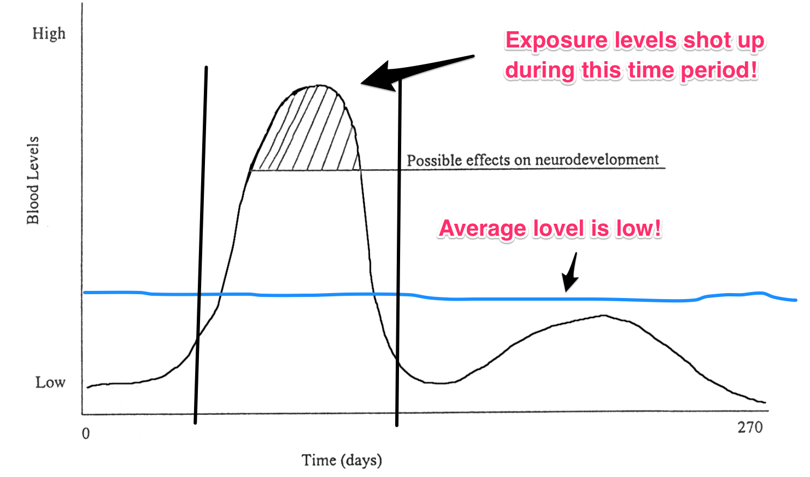

# Human Health Risk Assessment in Environmental and Occupational Health

## What is Human Health risk assessment 

- A process 
- We can evaluate the potential for Adverse Health Effects
- Exposure can be
- Naturally occurring or 
- Synthetic agents

## Why Should We do HHRA
- Regulatory agencies in the US for instance have used the risk assessment process for nearly 50 years
- Risk Assessments we conduct these days are more accurate
- We use physiology based pharmacokinetic models (also known as PBPK models)
- Most environmental regulations and some occupational health standards have been based on HRA
- A long list of chemicals worldwide have been regulated and monitoried using this technique
- This is central to understanding environmental and occupational health issues

## What happens in HRA

- Evaluate Toxicology data from animal and human studies and human epidemiology 
- Apply mathematical formula 
- Predict the response at low doses, 
- Use information about the degree of exposure  
- Quantitatively predict the likelihood that a particular adverse response in a specific human population

## What are the steps of Exposure Assessment?

## Human Health Risk Assessment


- HHRA has four steps as follows
- First Step: We identify hazards in the environment and in workplaces or occupational settings
- Second Step: We assess how much exposure exists in the environment
- Third Step: We assess the shape and properties of known dose response relationships
- Final Step: We characterise the risk if one is exposed to a hazard

## Objectives of this lesson

- We shall learn about human health risk assessment
- We shall learn what is meant by the term Hazard
- We shall know the difference between hazard and risk
- We shall learn the difference between exposure and dose
- In the next lecture in the series, we shall do some hands-on exercises

## Diagram of HHRA


## What is Hazard Identification?
- The first step in HHRA
- We learn about different types of hazards present
- In the environment and workplace
- Can you think of some hazards present in the classroom
- Can you thin of some hazards that you may encounter in your workplace? 
- Toxicology and Epidemiology

## What do we mean by Hazard?
- A hazard is something that can cause potential harm
- That harm need not be realised now
- It is sufficient if that object is deemed to cause harm
- A harm has not yet occurred but its potential to occur provided it has not occurred so far is a characteristic of Hazard
- It is the potential that we are worried about

## How do we learn about Hazards?
- Toxicology and Epidemiology
- Toxicology involves Animal experiments
- Tests conducted in laboratories
- Human tissues
- Epidemiology = Epidemiological studies
- While toxicology has become refined, most advances are in the field of exposure assessment

## Animal Experiments
- Studies that have been conducted on animals
- For example exposing animals such as rats to
- Radiation, or chemicals
- Study the responses

## Issues with Animal Studies
- Not all human diseases can be reproduced
- Arsenic toxicity and cancer related to As cannot be reproduced in rats and mice
- The animal tissues are not exactly similar to humans
- Different number of chromosomes, different genes involved

## Why is it important to use Animal Studies?
- Less risky than subjecting to Humans
- You cannot study certain effects by subjecting humans to those exposure (Unethical)
- Relatively less expensive and less time consuming

## Human Tissue based Studies
- Tissue samples are obtained from humans
- Tissue samples are subjected to varying conditions of exposure
- Tissue samples are then tested for generation of products or toxic changes
- Useful for studying effects such as cancers
- It is doubtful if *in vitro* studies would mimic exactly what happens *in vivo*

## Epidemiological Studies
- This is a population based approach
- Observational epidemiological studies
- Usually cross-sectional surveys
- Case control studies
- Rarely cohort studies

## What is meant by Exposure Assessment?

- A vital step in the risk assessment process 
- This step quantifies the uptake of an agent 
- That uptake results from contact with various environmental media 
- Air, Water, Soil, Food
- Can address past, current, or future anticipated exposures

## Elements of Exposure Assessment

- Industrial hygiene, 
- Radiological health,  
- Biochemical and large animal toxicology
- Atmospheric sciences
- Analytical chemistry 
- Physiology, Food sciences and Nutrition
- Relies upon statistics, Environmental modeling 

## Importance of Exposure Assessment

“Toxicology data are important, but they do not mean much without quantitative information about human exposure.”

## What do we do in exposure assessment?
- Describe the nature and size of the various populations Exposed to a chemical agent or another agent 
- Describe the magnitude of exposures
- Describe duration of exposures
- Determine the degree of contact a person has with a chemical 
- We estimate the magnitude of the absorbed dose

## What does the word "contact" mean here?

- No agreement on this term: somewhat confusing
- Does this mean contact with the visible exterior of the person?
- Or, does it mean exchange boundaries where absorption takes place (skin, lungs, gastrointestinal tract)

## Three Approaches to Exposure Assessment

- **Direct measurement** (Measure at the point of contact)
- Example: Measure amount of soil or petrol or another chemical on the hand of the person at the time
- **Exposure Scenario** (Develop a hypothetical scenario and then run your estimates)
- When should you do this? When you cannot directly measure the exposure
- **Biomonitoring** Measure known metabolites or products in the body itself (cotinine in urine for nicotine exposure, or benzene metabolites). Think of routine police checks by the roadside
- These three approaches are complementary and independent of each other: so use them in combination for best effect


## Concept of Exchange Boundaries
- Outer boundary 
- Skin
- Mouth (Oral cavity)
- Nostrils
- If there is a puncture in the skin or wound
- The chemical comes and touches this boundary

## Exposure Assessment with Exchange Boundaries
- Intensity, frequency, duration of contact
- Route the chemical takes in traversing that boundary
- How much chemical or agent actually crosses
- What is the amount that reaches the final target organ (dose)
- Expressed in terms of amount/volume-time (eg mg/Kg body weight - hour)

## Exposure Dose, Intake, Uptake

- Chemical comes in contact with the exchange barrier
- Chemical enters the body
- Absorption is the process by which the chemical comes in contact with the biological significant site
- How do we estimate the degree to which the chemical cross the boundary?

## Concepts of Intake and Uptake
- Intake = physically moving the chemical 
- Move through an opening in the outer boundary
- Mouth, nose, inhalation, eating, drinking
- Chemical in the media >> now enters the body
- Uptake: chemical absorbed through skin/wounds
- Uptake == Intake?

## Uptake versus Intake

"...if a chemical cannot be released from a medium (say soil particle), then it has no bioavailability and, consequently, since there is no uptake the chemical does not pose a risk" (Paustenbach, 2000)

## Different types of doses
- Applied dose = the amount of chemical available at the absorption barrier
- If we know the applied dose, then we can estimate the internal dose that an individual will be exposed to
- Potential dose = amount of chemical ingested/inhaled/applied to skin
- The potential dose does not mean that all of the concentration in the medium, depends on bioavailability
- Bioavailability = amount of the exposure chemical that actually reaches the barrier
- Internal dose = amount of chemical that has been absorbed and is available for interaction with target organ
- Estimation of internal dosage is the first objective of exposure assessment
- Biologically effective dose = the amount that actually reaches the cells or tissues

## How do we characterise exposure?

- One time estimation of the exposure molecule in body fluid
- Works very well for short acting compounds
- The biological half-life of a toxin is very important 
- Pharmacokinetics is the way a body deals with a toxin
- Pharmacodynamics is the action a toxin to the body
- The duration of stay of a toxin in the body is important

## Pathways of Exposure, Paustenbach (2000)


## Routes of Exposure
- Dust and vapor inhalation, 
- Skin contact with contaminated soils or dusts, 
- Oral route, eating contaminated food, 
- Drinking water, 
- Eating or through food, dust, or soil
- Inhalation (workplace)
- Skin uptake
- Hand to mouth oral route

## Importance of time during exposure, Paustenbach (2000)



## What is half life and why important
- Half life = how long before 50% of the toxin is gone from the body 
- Half life can be short or long (arbitrary)
- If we are dealing with a toxin of short half life, then one time rapid meaurement in the body fluid important
- If we are dealing with a toxin with long half life, then we need to plan longer term measurement


## Strategies of measuring exposure
- if it has very long half life (> 90 days)
- Annual average exposure by integrating exposure patterns
- Aggregate exposure = sum total of exposure through all the different routes
- Time Weighted Average (TWA) - use it particularly for known toxins that can cause cancer
- TWA = Total dose / Time period (example mg/Kg - day)

## What is meant by Dose?
- Dose is the amount of exposure at the target organ
- Factors that influence dose:
- Duration of Exposure
- Route of Exposure
- Bioavailability of the contaminant media
- Characteristics of the exposed population
- For humans, pathways and patterns of metabolism of the chemical that is absorbed

## What is the difference between Exposure and Dose?
- Exposure is the amount of the agent we are opened up to
- This exposure does not necessarily mean that we are going to be harmed
- Exposure is the mechanism by which an agent gets entry into human body
- Enters the human body and gets access to the specific tissue 
- If we put barriers to entry of the exposure agent and control the exposure pathway, then even though the exposure may be high, the dose is low
- So, exposure and dose are two different things

## Average Daily Dose

$$ ADD = (C * IR * D * B) / (BW * AT) $$

ADD = Potential Average Daily Dose
C = Exposure Concentration
IR = Rate of Ingestion or Intake
D = Duration over which exposed to toxin
B = Bioavailability
BW = Body Weight
AT = Time period over which you are averaging the exposure

## Calculate the average daily dose of Aldrin

- Over a lifetime, in NZ, we eat say about 1500 kg of Lettuce. 
- Lettuce contains a pesticide Aldrin (average 4 mg/Kg on all lettuce eaten over lifetime)
- In a week, say we eat 500g (0.5 kg) of lettuce
- Maximum in any day is 0.04 kg/d (like 40 grams)
- Assume 90% of Aldrin will be available to body
- Calculate the average daily dose of Aldrin for a 70 kg person

## From the above we have

C (Toxin Concentration) = 4 mg/kg (aldrin)
IR (Intake Rate) = 0.5 kg/week
D (Duration of Intake) = 1 week
B (Bioavailability at 90%) = 0.9 
BW (body weight) = 70 kg
AT (Averaged over 7 days) = 7

Plug these values in the above formula and calculate the average daily dose. 


```R
## Answer to the Aldrin Problem
addcalc <- function(c, i, d, b, bw, at){
    addnum <- c * i * d * b
    adddenom <- bw * at
    addcalc <- round(addnum/adddenom, 5)
    return(addcalc)
}
```


```R
## Result of the function
print(addcalc(4, 0.5, 1, 0.9, 70, 7))
print(70 * 350)
```

    [1] 0.00367
    [1] 24500


## What happens if the toxin can cause cancer?

- The response is usually described in terms of lifetime probabilities
- Even if the actual exposure does not occur over entire lifetime, we still talk in terms of lifetime averaged daily dosage
- LADD = Lifetime averaged daily dosage
- As if that occurred throughout the person's life (how else do we know?)

## How do we calculate LADD?

$$ LADD = (C * SI * D * B ) / (BW * LT) $$
LADD = Lifetime Averaged Daily Dose (for cancer toxins)
C = Concentration of the toxin
SI = Summed average rates over lifetime (assume 70 years of life) 
SI = $$ IR * D $$
IR = Ingestion rate per unit time
D = Duration of life (70 years)
B = Bioavailability
BW = Body Weight
LT = Lifetime expressed in days

## Run the exercise again, this time with LADD

We have
C (Toxin Concentration) = 4 mg/kg
SI (Summated Ingestion) = 70 years * 0.5 kg/wk roughly, SI = 7000 (say 50 weeks/year) / 70 kg = 100 kg/bw
D (Duration of life) = 70 years
B (Bioavailability) = 0.9
BW (Body weight) = 70 kg
LT (lifetime in days) = 24550 (say 350 days/year)


```R
## Here is the LaDD formula
ladd <- round((4 * 100 * 70 * 0.9) / (70 * 24500), 3)

```


```R
print(ladd) # in mg/kg-d
```

    [1] 0.015


## Concentration of the chemical in the Medium Essential
- To estimate the magnitude of the dose
- Usually obtained by analytical measurements of samples of the contaminated medium
- Mathematical Models

## Summary and Key Points
- HHRA is Human Health Risk Assessment
- We will discuss in two parts
- Four steps: Hazard Identification, Exposure Assessment, Dose Response Assessment, Risk Characterisation
- We discussed Hazard Identification and Exposure Assessment today
- Exposure is not the same as Dose
- Next week, we shall continue with Concepts of Dose and Dose-Response Assessment
- Next Week, we shall also discuss Risk and Risk Characterisation
